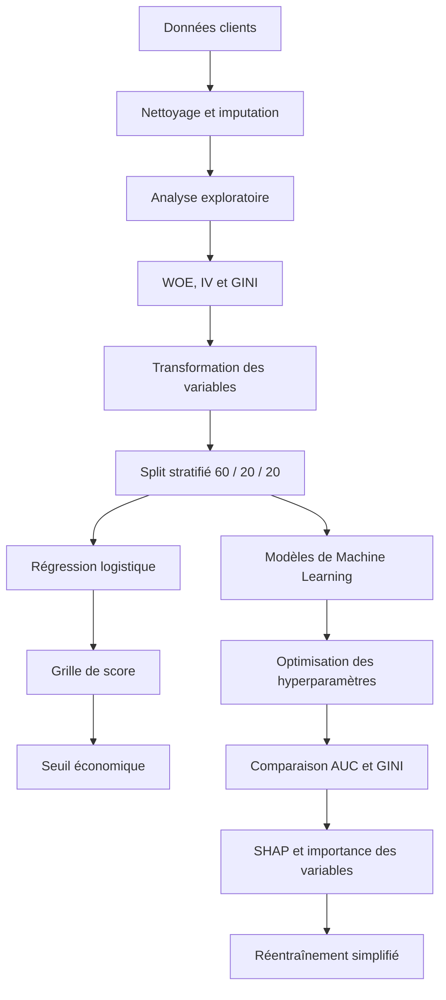

# Scoring de crédit bancaire : grille de score et Machine Learning


Projet académique consacré à la conception d’un outil automatisé d’aide à la décision pour l’octroi de crédits à la consommation.

Le projet combine :

- analyse exploratoire de données ;
- préparation et transformation des variables ;
- mesure du pouvoir prédictif ;
- régression logistique ;
- construction d’une grille de score ;
- optimisation d’un seuil de décision ;
- comparaison de modèles de Machine Learning ;
- interprétabilité avec SHAP ;
- analyse de l’impact économique.

L’objectif est de prévoir si un client sera un bon ou un mauvais payeur, tout en conciliant :

- performance statistique ;
- interprétabilité ;
- maîtrise du risque ;
- rentabilité économique ;
- simplicité opérationnelle.

> Projet réalisé par Benjamin Baillet, Alexandra Millot et Ismail Ouazzani Chahdi dans le cadre du Master IREF de l’Université de Bordeaux, année universitaire 2024-2025.

---

## Sommaire

- [Contexte](#contexte)
- [Problématique](#problématique)
- [Objectifs](#objectifs)
- [Données](#données)
- [Variable cible](#variable-cible)
- [Architecture du projet](#architecture-du-projet)
- [Préparation des données](#préparation-des-données)
- [Analyse exploratoire](#analyse-exploratoire)
- [Mesure du pouvoir prédictif](#mesure-du-pouvoir-prédictif)
- [Préparation de la modélisation](#préparation-de-la-modélisation)
- [Régression logistique](#régression-logistique)
- [Construction de la grille de score](#construction-de-la-grille-de-score)
- [Évaluation de la grille](#évaluation-de-la-grille)
- [Modèles de Machine Learning](#modèles-de-machine-learning)
- [Optimisation des hyperparamètres](#optimisation-des-hyperparamètres)
- [Résultats des modèles](#résultats-des-modèles)
- [Interprétabilité](#interprétabilité)
- [Impact économique](#impact-économique)
- [Réentraînement avec les meilleures variables](#réentraînement-avec-les-meilleures-variables)
- [Structure du dépôt](#structure-du-dépôt)
- [Exécuter le projet](#exécuter-le-projet)
- [Technologies utilisées](#technologies-utilisées)
- [Compétences démontrées](#compétences-démontrées)
- [Limites](#limites)
- [Pistes d’amélioration](#pistes-damélioration)
- [Auteurs](#auteurs)
- [Avertissement](#avertissement)

---

# Contexte

Le risque de crédit constitue un enjeu majeur pour les institutions financières.

Lorsqu’une banque accorde un crédit, elle doit estimer la probabilité que le client rembourse correctement son emprunt.

Une mauvaise décision peut entraîner :

- une perte du capital prêté ;
- une augmentation du coût du risque ;
- une détérioration de la rentabilité ;
- une mobilisation inutile des équipes ;
- une dégradation de l’expérience client.

L’automatisation du processus d’octroi permet de :

- traiter rapidement un grand nombre de demandes ;
- homogénéiser les décisions ;
- détecter les profils présentant un risque élevé ;
- améliorer la maîtrise des pertes ;
- fournir une justification quantitative de la décision.

---

# Problématique

Le projet cherche à répondre à la question suivante :

> Comment concevoir un outil automatisé capable d’analyser les profils clients, d’évaluer leur risque de défaut et de proposer une décision d’acceptation ou de refus du crédit ?

La solution doit remplir trois fonctions principales :

1. analyser le portefeuille de clients ;
2. construire une grille de score interprétable ;
3. challenger cette grille avec des modèles de Machine Learning.

---

# Objectifs

## Objectif 1 — Analyse descriptive

- comprendre la structure du portefeuille ;
- analyser les variables numériques et catégorielles ;
- traiter les valeurs manquantes ;
- détecter les valeurs extrêmes ;
- étudier les distributions ;
- mesurer les corrélations avec la cible ;
- calculer les taux de risque ;
- évaluer le pouvoir prédictif des variables.

## Objectif 2 — Grille de score

- préparer les ensembles d’entraînement, de validation et de test ;
- traiter le déséquilibre des classes ;
- transformer les variables ;
- calculer le Weight of Evidence ;
- calculer l’Information Value ;
- entraîner une régression logistique ;
- sélectionner les variables significatives ;
- créer une grille comportant au maximum six variables ;
- normaliser le score ;
- vérifier la monotonie ;
- déterminer un seuil de décision ;
- mesurer l’impact économique.

## Objectif 3 — Machine Learning

- comparer plusieurs algorithmes ;
- optimiser leurs hyperparamètres ;
- évaluer leurs performances ;
- calculer l’AUC et le GINI ;
- analyser l’impact économique ;
- interpréter les décisions ;
- réentraîner les modèles avec les variables les plus importantes.

---

# Données

## Base initiale

La base d’origine contient :

```text
307 511 clients
22 caractéristiques
```

Elle regroupe des informations :

- personnelles ;
- familiales ;
- professionnelles ;
- financières ;
- immobilières ;
- relatives au crédit demandé ;
- issues de bureaux de crédit externes.

## Base nettoyée publiée

Le fichier présent dans le dépôt est :

```text
donnees/good_data.csv
```

Il contient :

```text
252 131 clients
21 colonnes
```

Cette base correspond à la version nettoyée et préparée pour la modélisation.

---

# Dictionnaire des variables

| Variable | Description |
|---|---|
| `SK_ID_CURR` | Identifiant du client |
| `GOOD_PAYER` | Statut de remboursement |
| `CODE_GENDER` | Genre déclaré du client |
| `FLAG_OWN_CAR` | Possession d’une voiture |
| `FLAG_OWN_REALTY` | Statut de propriétaire |
| `CNT_CHILDREN` | Nombre d’enfants |
| `AMT_INCOME_TOTAL` | Revenu total |
| `AMT_CREDIT` | Montant du crédit demandé |
| `AMT_GOODS_PRICE` | Valeur du bien financé |
| `NAME_INCOME_TYPE` | Type de revenu |
| `NAME_CONTRACT_TYPE` | Type de contrat de crédit |
| `NAME_EDUCATION_TYPE` | Niveau d’études |
| `NAME_FAMILY_STATUS` | Situation familiale |
| `NAME_HOUSING_TYPE` | Situation de logement |
| `OCCUPATION_TYPE` | Profession |
| `ORGANIZATION_TYPE` | Secteur ou organisation d’emploi |
| `EXT_SOURCE_2` | Score externe de crédit numéro 2 |
| `EXT_SOURCE_3` | Score externe de crédit numéro 3 |
| `AMT_REQ_CREDIT_BUREAU_YEAR` | Nombre de demandes adressées aux bureaux de crédit |
| `AGE_YEARS` | Âge du client en années |
| `YEARS_EMPLOYED` | Ancienneté professionnelle |

---

# Variable cible

La variable cible est :

```text
GOOD_PAYER
```

Interprétation :

```text
1 = aucun retard de remboursement
0 = retard ou défaut de remboursement
```

La base nettoyée est fortement déséquilibrée :

```text
Environ 91,34 % de bons payeurs
Environ 8,66 % de mauvais payeurs
```

Ce déséquilibre constitue un enjeu important : un modèle naïf pourrait obtenir une forte accuracy en prédisant presque toujours la classe majoritaire.

---

# Architecture du projet



---

# Préparation des données

## Valeurs manquantes

Sept variables de la base d’origine contiennent des valeurs manquantes.

Leur proportion varie d’environ :

```text
0,09 % à 56,38 %
```

Les variables présentant plus de 40 % de valeurs manquantes ont été supprimées :

```text
EXT_SOURCE_1
TOTALAREA_MODE
```

Les autres valeurs ont été traitées selon plusieurs méthodes :

- imputation conditionnelle ;
- KNN Imputation ;
- modalité la plus fréquente ;
- création d’une catégorie dédiée ;
- utilisation de variables connexes.

Exemple :

```text
OCCUPATION_TYPE
```

peut être imputée en tenant compte de :

```text
NAME_INCOME_TYPE
```

---

## Conversion des variables temporelles

Les variables initiales exprimées en jours ont été converties pour améliorer leur lisibilité :

```text
DAYS_BIRTH → AGE_YEARS
DAYS_EMPLOYED → YEARS_EMPLOYED
```

---

## Valeurs extrêmes

La variable :

```text
AMT_INCOME_TOTAL
```

contenait une valeur très éloignée du reste de la distribution, proche de 117 millions.

Les valeurs extrêmes ont été analysées avec différentes approches :

- méthode de l’écart interquartile ;
- Isolation Forest ;
- analyse graphique ;
- transformation logarithmique ;
- suppression des observations considérées comme aberrantes.

---

## Transformations

Des transformations logarithmiques ou par racine carrée ont été étudiées pour réduire l’asymétrie de variables telles que :

- `AMT_INCOME_TOTAL` ;
- `CNT_CHILDREN` ;
- `AMT_CREDIT` ;
- `AMT_GOODS_PRICE`.

---

# Analyse exploratoire

## Analyse univariée

L’analyse descriptive comprend :

- moyenne ;
- médiane ;
- écart-type ;
- quartiles ;
- minimum ;
- maximum ;
- skewness ;
- kurtosis ;
- tests de normalité ;
- distributions graphiques.

Les tests de Kolmogorov-Smirnov réalisés dans le notebook ne permettent pas de retenir l’hypothèse de normalité pour les variables numériques analysées.

Certaines variables présentent une asymétrie positive :

- `AMT_INCOME_TOTAL` ;
- `CNT_CHILDREN` ;
- `AMT_GOODS_PRICE` ;
- `YEARS_EMPLOYED`.

D’autres présentent une asymétrie négative :

- `GOOD_PAYER` ;
- `EXT_SOURCE_2` ;
- `EXT_SOURCE_3`.

---

## Analyse bivariée

Les relations avec la cible sont étudiées avec :

- ANOVA ;
- corrélation de Pearson ;
- test du Chi² ;
- taux de risque par modalité ;
- visualisations.

### Variables catégorielles importantes

Les tests réalisés mettent notamment en évidence :

- `CODE_GENDER` ;
- `NAME_EDUCATION_TYPE` ;
- `NAME_FAMILY_STATUS` ;
- `NAME_INCOME_TYPE`.

### Variables numériques importantes

Les corrélations les plus élevées avec la cible concernent notamment :

- `EXT_SOURCE_2` ;
- `EXT_SOURCE_3` ;
- `AMT_GOODS_PRICE` ;
- `AGE_YEARS` ;
- `AMT_CREDIT` ;
- `YEARS_EMPLOYED`.

Les corrélations restent toutefois modérées, ce qui suggère que le risque de crédit dépend de plusieurs facteurs combinés.

---

## Visualisations

Le notebook génère notamment :

- histogrammes ;
- boxplots ;
- diagrammes en barres ;
- diagrammes circulaires ;
- nuages de points ;
- matrices de corrélation ;
- distributions par classe ;
- courbes ROC ;
- matrices de confusion ;
- courbes KS ;
- courbes d’équilibre financier ;
- graphiques SHAP.

---

# Mesure du pouvoir prédictif

## Weight of Evidence

Le Weight of Evidence mesure la relation entre une modalité et le risque observé.

Il permet de transformer les variables en valeurs adaptées à la construction d’une grille de score.

Pour une modalité \(i\) :

```math
WOE_i =
\ln\left(
\frac{\%\,GOOD_i}{\%\,BAD_i}
\right)
```

---

## Information Value

L’Information Value mesure le pouvoir prédictif global d’une variable.

Échelle utilisée dans le projet :

| Valeur de l’IV | Interprétation |
|---:|---|
| 0 à 0,02 | Faiblement prédictive |
| 0,02 à 0,10 | Moyennement prédictive |
| 0,10 à 0,30 | Modérément prédictive |
| Supérieure à 0,30 | Fortement prédictive |

Les variables dont l’IV est inférieur à 0,02 peuvent être supprimées afin de réduire le bruit et la complexité.

Les variables suivantes présentent un IV trop faible dans l’analyse :

- `FLAG_OWN_CAR` ;
- `FLAG_OWN_REALTY` ;
- `NAME_CONTRACT_TYPE` ;
- `NAME_HOUSING_TYPE`.

---

## Indice de GINI

L’indice de GINI mesure la capacité d’une variable ou d’un modèle à discriminer les bons et les mauvais payeurs.

Il est relié à l’AUC par :

```math
GINI = 2 \times AUC - 1
```

Les variables les plus discriminantes dans l’analyse univariée comprennent notamment :

- `EXT_SOURCE_2` ;
- `EXT_SOURCE_3` ;
- `AGE_YEARS` ;
- `YEARS_EMPLOYED` ;
- `AMT_GOODS_PRICE`.

---

# Préparation de la modélisation

## Découpage des données

La base est divisée en trois ensembles :

```text
60 % : entraînement
20 % : validation
20 % : test
```

Le découpage est stratifié afin de conserver une proportion comparable de bons et de mauvais payeurs dans chaque ensemble.

```python
X_train, X_temp, y_train, y_temp = train_test_split(
    X,
    y,
    test_size=0.4,
    stratify=y,
    random_state=42
)
```

---

## Déséquilibre des classes

La base contient environ 91 % de bons payeurs contre 9 % de mauvais payeurs.

Plusieurs méthodes sont envisagées :

- SMOTE ;
- undersampling ;
- pondération des classes.

La méthode principale retenue consiste à attribuer des poids aux observations.

Les mauvais payeurs, moins nombreux, reçoivent un poids supérieur afin d’augmenter leur influence pendant l’apprentissage.

Cette méthode évite :

- de supprimer des observations ;
- de créer des clients artificiels ;
- de perdre de l’information.

---

## Variables catégorielles

Les variables catégorielles sont transformées avec :

- One-Hot Encoding ;
- encodage ordinal ;
- regroupement par taux de risque ;
- regroupement par fréquence ;
- indicatrices imbriquées.

---

## Variables numériques

Les variables numériques sont traitées avec :

- standardisation ;
- normalisation ;
- binning ;
- segmentation par GINI ;
- segmentation par expertise ;
- transformation WOE.

Une vérification de la volumétrie est réalisée afin d’éviter des tranches contenant moins de 5 % de la population.

---

# Régression logistique

## Méthode ascendante

La sélection commence avec un modèle contenant uniquement l’intercept.

Les variables sont ensuite ajoutées progressivement selon :

- l’AIC ;
- le test de vraisemblance ;
- la significativité des coefficients ;
- leur pouvoir prédictif.

Le processus s’arrête lorsqu’aucune nouvelle variable n’améliore significativement le modèle.

---

## Réduction du nombre de variables

La première sélection ascendante produit un modèle comprenant 23 variables.

Les variables non significatives sont ensuite supprimées, conduisant à un modèle de 20 variables.

Une nouvelle réduction est réalisée avec :

- Information Value ;
- VIF ;
- Lasso ;
- significativité statistique.

Le modèle simplifié conserve finalement 14 variables explicatives.

---

## Résultats de la régression logistique

Les principaux résultats présentés dans le notebook sont :

```text
R² ajusté : environ 0,0938
AIC : 80 781,35
BIC : 80 920,32
```

Le pouvoir explicatif reste modéré, mais le modèle présente l’avantage d’être :

- transparent ;
- relativement simple ;
- facilement transformable en grille de score ;
- interprétable par les équipes métier.

Parmi les variables les plus influentes figurent :

- `EXT_SOURCE_2` ;
- `EXT_SOURCE_3` ;
- `YEARS_EMPLOYED` ;
- `AGE_YEARS` ;
- `AMT_CREDIT` ;
- `AMT_GOODS_PRICE`.

---

# Construction de la grille de score

La grille de score est créée à partir des coefficients de la régression logistique.

Elle doit intégrer au maximum :

```text
6 variables
```

## Paramètres de normalisation

```text
Score de référence : 500
Facteur multiplicatif : 2
Points to Double the Odds : 20
Ratio de référence : 1
```

Le principe consiste à transformer les log-odds du modèle en un score facilement exploitable par les équipes d’octroi.

---

## Monotonie

Une grille cohérente doit respecter la relation suivante :

```text
Risque plus élevé → score moins favorable
Risque plus faible → score plus favorable
```

Certaines incohérences initiales de monotonie ont été corrigées avec :

- regroupement de modalités ;
- lissage des points ;
- réordonnancement ;
- regroupement adaptatif des tranches.

---

# Évaluation de la grille

La grille est évaluée sur les trois ensembles.

## Indicateurs utilisés

- indice de GINI ;
- courbe de concentration ;
- courbe ROC ;
- statistique KS ;
- tableau des déciles ;
- matrice de confusion ;
- distribution des scores ;
- AIC ;
- BIC ;
- R² ajusté ;
- impact économique.

---

## Déciles

Les clients sont regroupés en dix tranches selon leur score.

L’objectif est de vérifier que :

- les déciles de score faible concentrent davantage de mauvais payeurs ;
- les déciles de score élevé concentrent davantage de bons payeurs ;
- le taux de risque évolue de façon cohérente avec le score.

---

## Statistique KS

La statistique KS correspond à la différence maximale entre les distributions cumulées des bons et des mauvais payeurs.

```math
KS =
\max
\left|
\%BAD_{cumulé}
-
\%GOOD_{cumulé}
\right|
```

Elle permet d’identifier la tranche de score offrant la meilleure séparation entre les deux populations.

---

# Modèles de Machine Learning

Plusieurs modèles simples et complexes sont testés afin de challenger la grille de score.

## Modèles simples

### Naive Bayes

Modèle probabiliste fondé sur le théorème de Bayes et une hypothèse d’indépendance conditionnelle entre les variables.

### Arbre de décision

Modèle interprétable qui segmente les clients selon une succession de règles.

### K-Nearest Neighbors

Méthode fondée sur les observations les plus proches dans l’espace des variables.

---

## Modèles complexes

### Random Forest

Agrégation de plusieurs arbres permettant de :

- réduire la variance ;
- limiter le surapprentissage ;
- capturer des relations non linéaires.

### Gradient Boosting

Construction séquentielle d’arbres corrigeant progressivement les erreurs des modèles précédents.

### XGBoost

Algorithme de boosting optimisé, adapté aux données tabulaires et capable de modéliser des relations complexes.

### Réseau de neurones

Un Multi-Layer Perceptron est testé afin de capturer des relations non linéaires supplémentaires.

---

# Optimisation des hyperparamètres

## Random Forest

Les hyperparamètres sont optimisés avec :

- `GridSearchCV` ;
- `RandomizedSearchCV` ;
- validation croisée.

Les paramètres étudiés comprennent notamment :

- nombre d’arbres ;
- profondeur maximale ;
- nombre minimal d’observations par feuille ;
- nombre de variables testées à chaque séparation.

---

## Gradient Boosting

Le modèle est optimisé avec une recherche aléatoire sur :

- `n_estimators` ;
- `learning_rate` ;
- `max_depth` ;
- `min_samples_split` ;
- `min_samples_leaf`.

---

## XGBoost

L’optimisation est réalisée avec Optuna.

Les hyperparamètres étudiés comprennent :

- `n_estimators` ;
- `learning_rate` ;
- `max_depth` ;
- `subsample` ;
- `colsample_bytree`.

---

# Résultats des modèles

## Performances après optimisation

| Modèle | AUC | GINI |
|---|---:|---:|
| Naive Bayes | 0,6944 | 0,3888 |
| Arbre de décision | 0,6968 | 0,3936 |
| K-Nearest Neighbors | 0,5866 | 0,1732 |
| Random Forest — GridSearchCV | 0,7066 | 0,4132 |
| Random Forest — RandomizedSearchCV | 0,7065 | 0,4131 |
| Gradient Boosting optimisé | 0,7083 | 0,4167 |
| XGBoost optimisé | **0,7088** | **0,4175** |
| Réseau de neurones | 0,7084 | Environ 0,4168 |

## Classement

Le modèle présentant la meilleure AUC est :

```text
XGBoost optimisé
```

Il est suivi de très près par :

```text
Réseau de neurones
Gradient Boosting
Random Forest
```

Les écarts de performance restent faibles entre les trois meilleurs modèles.

Le choix final ne doit donc pas reposer uniquement sur l’AUC, mais également sur :

- l’interprétabilité ;
- le coût de maintenance ;
- le temps d’entraînement ;
- la stabilité ;
- la facilité de déploiement ;
- l’impact économique.

---

# Interprétabilité

L’interprétabilité est étudiée avec trois approches.

## Importance interne des arbres

Random Forest, Gradient Boosting et XGBoost fournissent une mesure d’importance fondée sur la réduction de l’impureté.

## SHAP

SHAP permet d’évaluer la contribution de chaque variable à chaque prédiction.

Cette approche fournit :

- une interprétation globale ;
- une interprétation individuelle ;
- le sens de l’impact ;
- l’intensité de la contribution.

## Permutation Feature Importance

Cette méthode mesure la baisse de performance lorsque les valeurs d’une variable sont mélangées.

Une forte dégradation indique que la variable est importante.

---

## Variables les plus influentes

Les différentes méthodes convergent vers les variables suivantes :

```text
EXT_SOURCE_2
EXT_SOURCE_3
YEARS_EMPLOYED
AGE_YEARS
```

Les scores externes de crédit sont les variables les plus influentes.

L’ancienneté professionnelle et l’âge contribuent également à la décision, mais dans une moindre mesure.

---

# Impact économique

La performance statistique ne suffit pas pour choisir un modèle de crédit.

Les erreurs n’ont pas le même coût économique.

## Faux positif

Un mauvais payeur est accepté.

Dans le scénario du projet, la banque peut perdre la totalité du crédit financé.

## Faux négatif

Un bon payeur est refusé.

La banque perd le revenu potentiel associé aux intérêts, estimé à :

```text
8 % du crédit
```

---

## Seuil de décision

Une courbe d’équilibre financier est tracée afin de mesurer le gain ou la perte selon différents seuils.

Un seuil trop faible :

- accepte trop de clients risqués ;
- augmente le coût des défauts.

Un seuil trop élevé :

- refuse trop de bons clients ;
- réduit les revenus d’intérêts.

L’objectif est de déterminer le seuil qui offre le meilleur compromis entre :

- taux d’acceptation ;
- défauts ;
- pertes ;
- revenus potentiels.

Dans l’analyse comparative des modèles de Machine Learning, les résultats économiques restent proches et négatifs avec le seuil testé, malgré des AUC différentes.

Cela montre que :

- une meilleure AUC ne garantit pas automatiquement un meilleur résultat financier ;
- le calibrage des coûts est déterminant ;
- le choix du seuil doit être optimisé séparément pour chaque modèle.

---

# Réentraînement avec les meilleures variables

Après l’analyse des importances, les trois modèles d’arbres sont réentraînés avec seulement :

```text
EXT_SOURCE_2
EXT_SOURCE_3
YEARS_EMPLOYED
AGE_YEARS
```

## Résultats

| Modèle | AUC complète | AUC simplifiée |
|---|---:|---:|
| Random Forest | Environ 0,7067 | Environ 0,7060 |
| Gradient Boosting | Environ 0,7083 | Environ 0,7083 |
| XGBoost | Environ 0,7088 | Environ 0,7086 |

Les performances restent presque stables malgré la forte réduction du nombre de variables.

Cette simplification améliore potentiellement :

- l’interprétabilité ;
- la rapidité ;
- la maintenance ;
- la robustesse ;
- la facilité de déploiement.

---

# Structure du dépôt

```text
scoring-credit-bancaire-machine-learning/
│
├── README.md
│
├── code/
│   └── projet_scoring_BNP.ipynb
│
├── donnees/
│   └── good_data.csv (pas dans le dépôt car trop volumineux)
│
├── documentation/
│   ├── consignes_projet_scoring_credit.pdf
│   └── rapport_scoring_credit.pdf
│
└── resultats/
    ├── train_scores_results.csv (pas dans le dépôt car trop volumineux)
    ├── validation_scores_results.csv (pas dans le dépôt car trop volumineux)
    └── test_scores_results.csv (pas dans le dépôt car trop volumineux)
```

---

# Exécuter le projet

## Prérequis

- Python 3.10 ou supérieur ;
- Jupyter Notebook ;
- JupyterLab, VS Code ou Google Colab ;
- fichier `good_data.csv`.

---

## Installer les bibliothèques

```bash
pip install pandas numpy matplotlib seaborn scipy statsmodels scikit-learn imbalanced-learn xgboost optuna shap jupyter
```

---

## Ouvrir le notebook

Depuis la racine du projet :

```bash
jupyter notebook code/projet_scoring_BNP.ipynb
```

---

## Chemin vers la base nettoyée

Dans le notebook, utiliser :

```python
data = pd.read_csv("../donnees/good_data.csv")
```

Le fichier `good_data.csv` correspond à une base déjà nettoyée.

Les cellules qui précèdent son chargement présentent le processus de préparation appliqué à la base brute.

---

## Ordre d’exécution conseillé

1. chargement de la base nettoyée ;
2. analyse descriptive ;
3. analyse bivariée ;
4. calcul des taux de risque ;
5. calcul du WOE, de l’IV et du GINI ;
6. séparation train, validation et test ;
7. traitement du déséquilibre ;
8. transformation des variables ;
9. régression logistique ;
10. sélection des variables ;
11. construction de la grille ;
12. évaluation du score ;
13. entraînement des modèles de Machine Learning ;
14. optimisation des hyperparamètres ;
15. analyse SHAP ;
16. analyse économique ;
17. export des résultats.

---

## Fichiers exportés

Le notebook peut générer :

```text
train_scores_results.csv
validation_scores_results.csv
test_scores_results.csv
```

Pour les placer directement dans le dossier `resultats`, modifier les lignes d’export :

```python
X_train.to_csv(
    "../resultats/train_scores_results.csv",
    index=False
)

X_validation.to_csv(
    "../resultats/validation_scores_results.csv",
    index=False
)

X_test.to_csv(
    "../resultats/test_scores_results.csv",
    index=False
)
```

---

# Technologies utilisées

## Manipulation des données

- pandas ;
- NumPy.

## Statistiques

- SciPy ;
- Statsmodels ;
- ANOVA ;
- Pearson ;
- Chi² ;
- Kolmogorov-Smirnov ;
- skewness ;
- kurtosis ;
- VIF.

## Visualisation

- Matplotlib ;
- Seaborn.

## Machine Learning

- Scikit-learn ;
- XGBoost ;
- Imbalanced-learn.

## Optimisation

- GridSearchCV ;
- RandomizedSearchCV ;
- Optuna ;
- validation croisée.

## Interprétabilité

- SHAP ;
- Permutation Feature Importance ;
- importance interne des modèles d’arbres.

---

# Compétences démontrées

## Python

- manipulation de DataFrames ;
- fonctions ;
- pipelines ;
- automatisation ;
- export de résultats ;
- structuration d’un notebook.

## Data Analysis

- nettoyage ;
- imputation ;
- analyse descriptive ;
- visualisation ;
- traitement des valeurs extrêmes ;
- analyse de corrélation.

## Statistiques

- tests d’hypothèses ;
- ANOVA ;
- Pearson ;
- Chi² ;
- WOE ;
- Information Value ;
- GINI ;
- VIF ;
- AIC ;
- BIC.

## Scoring de crédit

- régression logistique ;
- grille de score ;
- binning ;
- monotonie ;
- déciles ;
- statistique KS ;
- seuil d’acceptation ;
- coûts des erreurs.

## Machine Learning

- Naive Bayes ;
- arbre de décision ;
- KNN ;
- Random Forest ;
- Gradient Boosting ;
- XGBoost ;
- réseau de neurones ;
- cross-validation ;
- optimisation des hyperparamètres.

## Interprétabilité

- feature importance ;
- SHAP ;
- permutation importance ;
- simplification des modèles.

## Analyse métier

- coût des faux positifs ;
- coût des faux négatifs ;
- équilibre financier ;
- décision d’octroi ;
- compromis entre performance et explicabilité.

---

# Limites

- La base nettoyée ne contient pas toutes les variables initiales.
- Le fichier brut n’est pas inclus dans la version actuelle du dépôt.
- La classe des mauvais payeurs est fortement minoritaire.
- Les corrélations individuelles avec la cible restent modérées.
- L’AUC maximale reste proche de 0,71.
- Les performances économiques dépendent fortement des coûts choisis.
- Un seuil optimal statistique n’est pas nécessairement optimal économiquement.
- Les données représentent une photographie historique.
- Les comportements futurs peuvent différer des comportements passés.
- Les scores externes jouent un rôle important et peuvent limiter l’autonomie du modèle.
- Certaines variables peuvent être sensibles dans un contexte réel.
- Le projet ne constitue pas un modèle bancaire homologué.
- Aucun suivi de dérive du modèle n’est mis en œuvre.
- Aucune API ou interface de décision n’est déployée.
- Les résultats restent ceux d’un exercice académique.

---

# Éthique et équité

Un modèle d’octroi de crédit peut avoir des conséquences importantes pour les personnes concernées.

Une utilisation réelle nécessiterait notamment :

- une analyse approfondie des biais ;
- une étude de l’équité entre groupes ;
- une vérification de la qualité des données ;
- une justification des variables utilisées ;
- une surveillance des dérives ;
- une procédure de recours humain ;
- une documentation complète des décisions.

La variable `CODE_GENDER` est étudiée dans le cadre académique.

Avant toute utilisation réelle, sa pertinence et son impact devraient être réévalués afin d’éviter qu’elle ne produise ou ne renforce des différences de traitement injustifiées.

---

# Pistes d’amélioration

- ajouter la base brute au dépôt ;
- transformer le notebook en modules Python ;
- créer un pipeline Scikit-learn complet ;
- sauvegarder les modèles avec Joblib ;
- mettre en place MLflow ;
- suivre les expériences ;
- utiliser une validation temporelle ;
- tester CatBoost ;
- approfondir le feature engineering ;
- calibrer les probabilités ;
- étudier la Precision-Recall Curve ;
- calculer le coût économique en euros ;
- intégrer le montant réel de chaque crédit ;
- ajouter des contraintes d’équité ;
- effectuer une analyse de stabilité ;
- calculer le Population Stability Index ;
- suivre la dérive des variables ;
- développer une API ;
- créer une interface Streamlit ;
- automatiser la production du score ;
- comparer les décisions automatiques à une validation humaine.

---

# Conclusion

Ce projet propose une chaîne complète de modélisation du risque de crédit :

```text
Données clients
      ↓
Nettoyage et exploration
      ↓
WOE, IV et GINI
      ↓
Régression logistique
      ↓
Grille de score
      ↓
Seuil économique
      ↓
Machine Learning
      ↓
Optimisation
      ↓
Interprétabilité
      ↓
Simplification du modèle
```

La régression logistique permet de créer une grille transparente et utilisable par les équipes métier.

Les modèles de Machine Learning améliorent la capacité de discrimination, avec XGBoost comme meilleur modèle de l’étude :

```text
AUC : 0,7088
GINI : 0,4175
```

L’analyse SHAP montre que les scores externes `EXT_SOURCE_2` et `EXT_SOURCE_3` sont les variables les plus influentes.

Le réentraînement avec seulement quatre variables conserve presque toute la performance, ce qui met en évidence l’intérêt d’un modèle plus simple et plus interprétable.

Enfin, le projet montre qu’une bonne performance statistique doit toujours être complétée par :

- une analyse économique ;
- une étude de l’équité ;
- une surveillance du modèle ;
- une validation métier.

---

# Auteurs

Projet réalisé par :

- Benjamin Baillet ;
- Alexandra Millot ;
- Ismail Ouazzani Chahdi.

Établissement :

```text
Université de Bordeaux
Master IREF
```

Année universitaire :

```text
2024-2025
```

## Benjamin Baillet

Compétences principales :

- Python ;
- Data Analysis ;
- Machine Learning ;
- scoring de crédit ;
- gestion des risques ;
- SQL ;
- Power BI ;
- R.

GitHub : [benjaminblt](https://github.com/benjaminblt)
